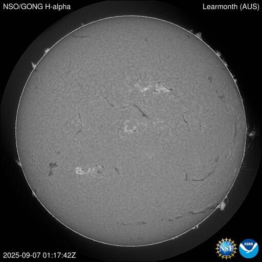
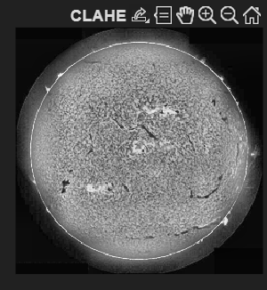
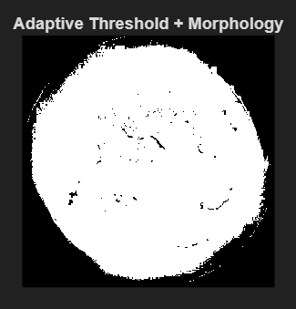
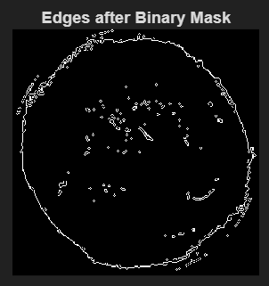
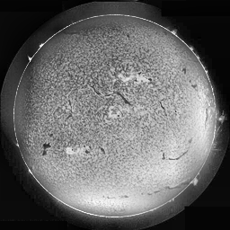

# FPGA-based Solar Filament / Sunspot Detection (Work in Progress)

This project explores using **FPGA acceleration** for real-time **solar H-alpha image analysis**, with the final goal of **detecting and segmenting solar filaments and sunspots**.

Currently, the work is split into two tracks:  
- **MATLAB simulation** (full preprocessing chain completed)  
- **ModelSim (Verilog) simulation** (CLAHE preprocessing completed)

---

## 🔎 1. Project Overview

- **Goal:** Detect solar filaments/sunspots in real time using FPGA.  
- **Motivation:** H-alpha solar images reveal key solar activity; FPGA provides speed + onboard deployability.  
- **Approach:** Begin with preprocessing (contrast enhancement → segmentation) before moving to detection.  

---

## 🧪 2. MATLAB Workflow (Full Prototype)

The complete image-processing chain was first implemented in MATLAB to validate each step:

1. **Grayscale Conversion** (input solar H-alpha images are already grayscale)  
2. **CLAHE** using `adapthisteq` (`ClipLimit=0.02`, `NumTiles=[8 8]`)  
3. **Binary Conversion** (thresholding for region extraction)  
4. **Edge Detection** (highlighting solar filaments/sunspots)

### MATLAB Outputs

| Original Image | CLAHE | Binary (BW) | Edge Detection |
|----------------|-------|-------------|----------------|
|  |  |  |  |

✅ This proves the full pipeline works in MATLAB.

---

## 🔄 3. Bridging MATLAB ↔ Verilog

Because ModelSim cannot read images directly:

- **Conversion (MATLAB → Verilog):**  
  - `write_hex_rowmajor.m` converts 256×256 grayscale image → `image.hex`.

- **Conversion (Verilog → MATLAB):**  
  - After simulation, `image_eq.hex` is produced.  
  - `hex2png_extended.m` converts this back to PNG for visualization.

This ensures identical inputs/outputs between MATLAB and Verilog.

---

## 🖥️ 4. ModelSim Workflow (Verilog Testbenches)

In Verilog/ModelSim, the focus so far has been on **CLAHE preprocessing**.

### Step 1: CLAHE without Interpolation
- File: `clahe_using_rom_tb_fixed.v`  
- Per-tile CLAHE (8×8 tiles).  
- Issue: Visible tile boundaries (checkerboard effect).

**Result:**  
| Original | CLAHE (No Interpolation) |
|----------|---------------------------|
|  |  |

---

### Step 2: CLAHE with Bilinear Interpolation
- File: `clahe_interp_final_tb.v`  
- Fix: Bilinear interpolation of LUTs across neighboring tiles.  
- Result: Seamless enhancement, visually matching MATLAB’s `adapthisteq`.

**Result:**  
| Original | CLAHE with Interpolation |
|----------|---------------------------|
|  |  |

---

## 🛠️ 5. Current Status

- **MATLAB:** ✅ Full pipeline tested (Grayscale → CLAHE → Binary → Edge Detection).  
- **ModelSim:** ✅ CLAHE preprocessing implemented (with interpolation).  
- **Next:** ➡️ Implement thresholding + edge detection stages in Verilog.  

---

## 📅 6. Future Work

- Complete **segmentation pipeline** in ModelSim (thresholding, edge detection).  
- Convert testbench to **synthesizable FPGA modules**:
  - Real-time histogram + CLAHE LUT generation using BRAM.  
  - Streaming pipeline with line buffers.  
- Deploy on FPGA hardware for **real-time solar filament / sunspot detection**.  

---

## 📜 License

Released under the MIT License.

